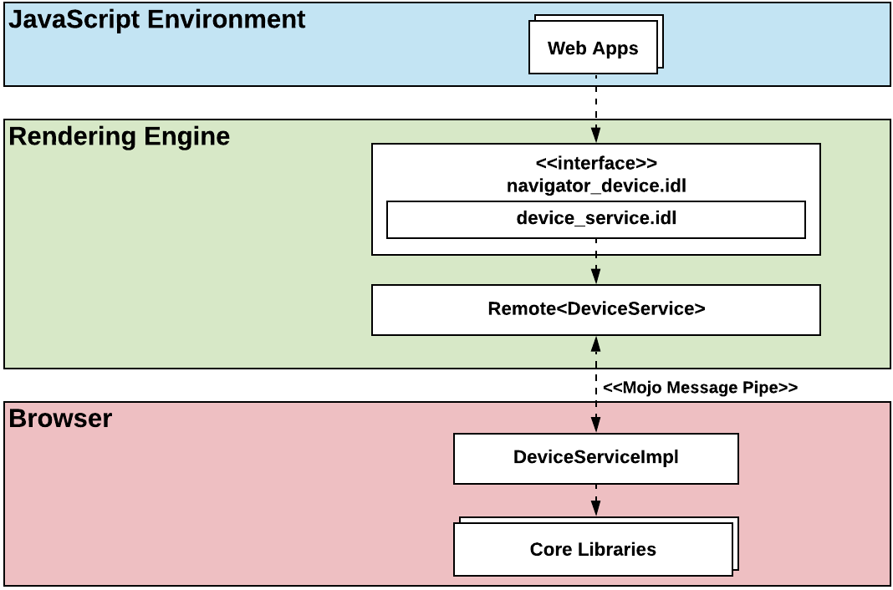
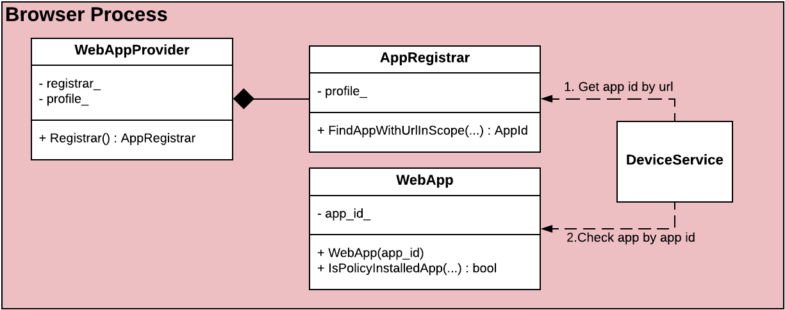

# navigator.device.*  Web API Exposure Design

# Objective

This document describes the infrastructure design of navigator.device.* namespace, and common characteristics that apply to all web APIs to be defined in it.


# Overview





<center><i>Infrastructure diagram of navigator.device.* namespace_</i></center>


To enable a new web API in the navigator.device.* namespace, the following two layers are the most important.


*   **Rendering Engine:** the WebIDL files describe the interfaces that are intended to be implemented in various web browsers.
*   **Mojo Service:** the mojom file and its implementation build the connection between the rendering engine and component libraries according to the concrete business logic.


# Trusted application


## Concept

Trusted applications mean the applications with the highest degree of trust. At the present stage, this concept is equal to the force-installed web applications configured by organization admins in the Google Admin Console.

There is an initiative to extend this scope of trusted application, which will allow common Web applications to use high-trusted permissions. But the related discussion is beyond the scope of this document.


## Verification

The trustworthiness of an application can be verified by the classes and methods that are provided by the web application component ([folder path](https://source.chromium.org/chromium/chromium/src/+/master:chrome/browser/web_applications/)).





<center><i>Class diagram of trusted application verification</i></center>

In the chrome browser, we can identify a WebAppProvider instance for the current profile, which contains a WebAppRegistrar class member** **capable of identifying Web Apps associated with the specific URL.


1. Call [AppRegistrar::FindAppWithUrlInScope(url)](https://source.chromium.org/chromium/chromium/src/+/master:chrome/browser/web_applications/components/app_registrar.h;drc=d7d32e0e4589b443ec32b54bd2315e353d78df52;l=152) method to get the app id correlated with the URL.
2. Construct a WebApp object based on the app id, then call [WebApp::IsPolicyInstalledApp]( https://source.chromium.org/chromium/chromium/src/+/master:chrome/browser/web_applications/web_app.h;drc=35be2105aca3aae2d24f0d7b312727e9b4cadd73;l=168) method to check whether it is a trusted application.


# Blink (Rendering Engine)


## Interface Definition

In the Blink layer, the [_navigator_](https://developer.mozilla.org/en-US/docs/Web/API/Navigator) interface will introduce a new namespace **_navigator.device_**. to contain the web APIs related to information / status about the local device. All web APIs in this namespace are exposed to **trusted applications** only.


```java
[
  ImplementedAs=NavigatorDevice,
  RuntimeEnabled=DeviceInterface
] partial interface Navigator {
  [SecureContext, SameObject]
  readonly attribute DeviceService device;
};
```


<center>NavigatorDevice interface definition</center>


```java
[
  SecureContext,
  Exposed=Window
] interface DeviceService {
  // Here we define methods for the navigator.device.
  [SameObject]
  readonly attribute SomeAPI someAPIs;
  readonly attribute SomeAPI someMoreAPIs;
};
```
<center>DeviceService interface definition</center>


## Trusted Context

There are few ways we can restrict this API:


*   Custom IDLExtendedAttribute to indicate high trusted context
*   Attach a dummy service to untrusted apps.
*   ContextEnabled=TrustedContext(new flag
*   **Always expose the new APIs, but fail on the processing side** 

We decided to stick with the later option since all the previous ones in one or another are implementation-specific aspects of Chromium/Blink, and should not be part of the standard. One the renderer side, we will implement the same idea as it is used for other permission-based APIs. The client will call an asynchronous API, which will depending on the trustworthiness check happening in the browser either fail with an exception or resolve the promise.

We have to anyway do a **trusted context** check in the browser side before each mojo call for safety in case the renderer is compromised, thus making any restrictions in the renderer side not imperative.

```java
enum DeviceAPIResult {
  OK,
  ErrorUntrusted
};

// Interface for handling user messages.
interface DeviceAPIService {
 // Example of a validated call to the browser.
 GetSomeData() => (DeviceAPIResult status, Value? data);
};

```


## Browser

On the Chrome browser side, will have a mojo service attached to each **_RenderFrameHost_**, which will accept these calls. Since the trustiness status of the app may change over the lifetime of the RenderFrame, we have to do a permissions check upon each mojo call dynamically. 

 


```c++
class DeviceAPIServiceImpl final
    : public content::FrameServiceBase<blink::mojom::DeviceService> {
 public:
  
  using GetSomeDataCallback =
      base::OnceCallback<void(
          blink::mojom::DeviceService status, 
           const base::Optional<std::string>& data)>;

   // Checks whether the context this service is attached to is trusted at this
  // moment. Must be called on each mojo call.
  bool IsTrustedContext();

  // mojom::blink::DeviceService:
  void GetSomeData(GetSomeDataCallback callback) override;

 Private:
  void GetSomeDataImpl(GetSomeDataCallback callback) override;
  content::RenderFrameHost* host_; 
};
```


 Alternatively, we could make a custom content// based solution, which does not attach any service at all, but this will require convoluted interactions between //content and //chrome/browser/ , which is not a thing usually done in [browser_interface_binders.cc](https://source.chromium.org/chromium/chromium/src/+/master:content/browser/browser_interface_binders.cc;drc=968139e2c8844a5ccb6fad97d238e45d1d5226f7;l=509).

From here, we can access any Chrome-specific data easily.

Since the apis are bound to the DOMWindow(a.k.a. Javascript Frame) and DeviceAPIService is bound to the Frame, there is 1:1 correspondence between them.


# Security considerations
Since all the checks regarding the trustworthiness of the application are made on the browser side, there is no obvious attack surface.

